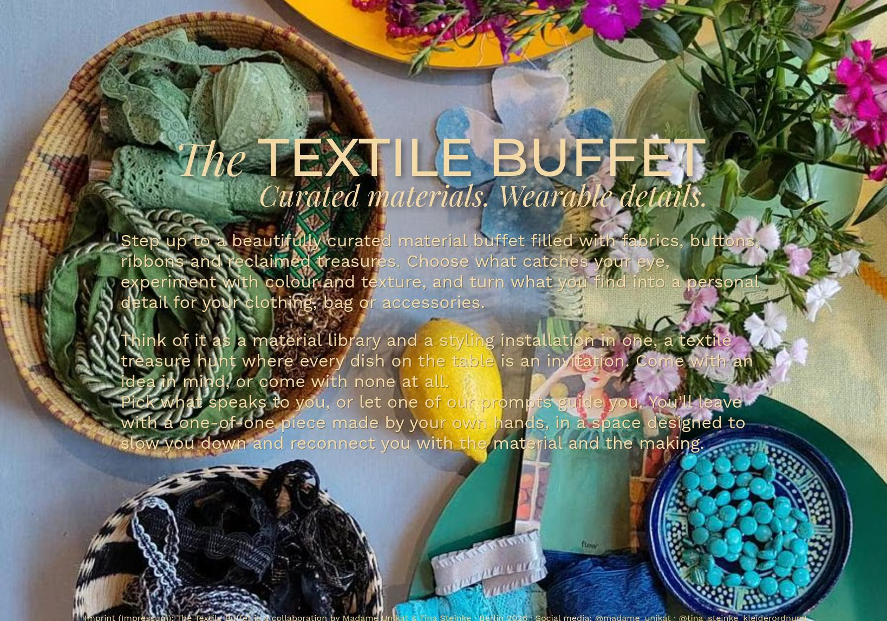

# The Textile Buffet

[thetextilebuffet.com](https://thetextilebuffet.com/)

Tech: Astro, HTML, CSS

## Editing Content

- go to [src/content/pages](./src/content/pages),
- click the page name you want to edit, like [Intro.md](./src/content/pages/Intro.md),
- click "edit this file" (small pencil icon on the right),
- change what you want to change,
- click "Commit changes..." (green button on the right),
- click "Commit changes" (similar green button in the middle)

TODO add screenshots

## building and testing

- `npm run test`
- `npm run build`
- open `dist/index.html`
- deploy to production

- TODO automate using GitHub and Netlify or something similar

TODO refine and replace initial placeholder
- use Astro to eliminate redundancies
- prettify source and export minified
- refine style
- add optional image change
  - use library when it makes sense
  - use TypeScript and transpile to JS
- add more content
- and/or use WP or another CMS suitable for the maintainers
  - they could edit the front matter in GitHub directly
  - how to generate and optimize images?

## Material

- color preferences
- font (preferably free one from Google fonts, hosted locally, matching existing social media material)
- poster image(s) = also use as social media preview og:image, ld+json
- logo / favicon
- initial text
  - intro paragraph
  - title claim / subtitle
- social media links?
- imprint?

## Manual Image Optimization for Placeholder Page

- save JPEG for web between 70 - 80 quality
- save another jpeg-master at 95 quality
- derive webp and avif from the master
  - `cwebp -q 75 -m 6 -mt -sharp_yuv thetextilebuffet-background-01-master.jpg -o thetextilebuffet-background-01.webp`
  - `avifenc -q 65 thetextilebuffet-background-01-master.jpg -o thetextilebuffet-background-01.avif`
